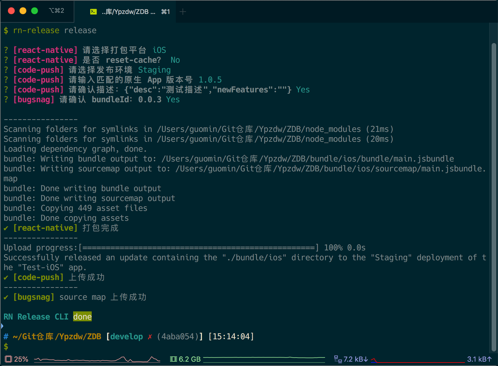

# rn-release-cli

## Installation

```
$ npm install -g rn-release-cli
```

## Usage

Create a new file like [rn-release.config.json](./config/rn-release.config.json) in your react-native root directory, then set the variable in the json file if needed. Otherwise, the command will use the default value.

```
$ cd ./Awesome-react-native
$ rn-release release
```

Use `rn-release -h` for more help.

## Screenshots


