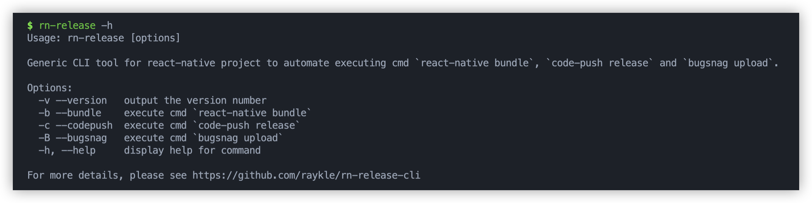
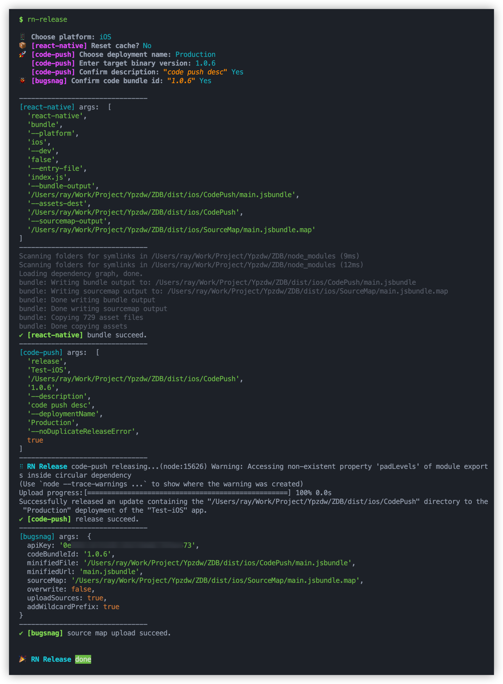

# rn-release-cli

[](//npmjs.com/package/rn-release-cli)
[](https://www.npmjs.com/package/rn-release-cli)


[](https://nodei.co/npm/rn-release-cli/)

Generic CLI tool for react-native project to automate executing cmd `react-native bundle`, `code-push release` and `bugsnag upload`.

## Installation

```
$ npm install -g rn-release-cli
```

## Usage

Step 1:

Create a new file named [rn-release.config.json](./config/rn-release.config.json) in your react-native root directory, then set the variable in the json file if needed. Otherwise, the command will use the default value.

Step 2:

```
$ cd ./Awesome-react-native
$ rn-release
```

`rn-release` is the same as command: `rn-release --bundle --codepush --bugsnag`.

<br>

_Note_: If execute the command with bouth `--codepush` and `--bugsnag` options, but the `deploymentName` args for `code-push` choose the `Staging`, the `bugsnag upload` command will be _skipped_.

For example: `rn-release --codepush --bugsnag`, `--bugsnag` option will be skipped if choose the `Staging` for `deploymentName`.

<br>

Use `rn-release -h` for more help.

<p>  <p>

## Example

<!--  -->
<p>  <p>

## License

[MIT](./LICENSE)

<br/>

<!-- [](https://www.buymeacoffee.com/raykle) -->
<!-- <a href="https://www.buymeacoffee.com/raykle" target="_blank"></a> -->
