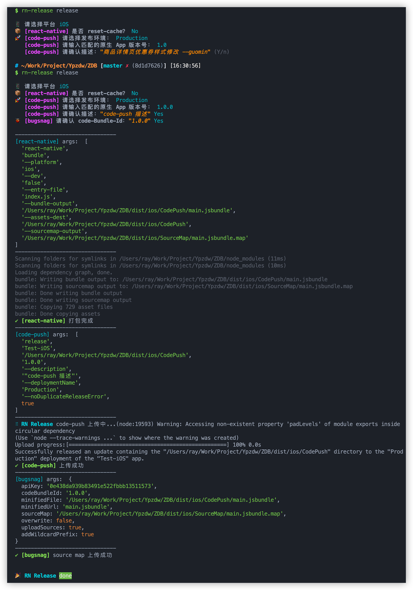

# rn-release-cli

[](//npmjs.com/package/rn-release-cli)
[](https://www.npmjs.com/package/rn-release-cli)


[](https://nodei.co/npm/rn-release-cli/)


## Installation

```
$ npm install -g rn-release-cli
```

## Usage

Create a new file like [rn-release.config.json](./config/rn-release.config.json) in your react-native root directory, then set the variable in the json file if needed. Otherwise, the command will use the default value.

```
$ cd ./Awesome-react-native
$ rn-release release
```

Use `rn-release -h` for more help.

## Screenshots

<!--  -->
<p>  <p>

## License

[MIT](./LICENSE)

<br/>

<!-- [](https://www.buymeacoffee.com/raykle) -->
<!-- <a href="https://www.buymeacoffee.com/raykle" target="_blank"></a> -->
